# 🏗️ System Architecture

## Overview
This document describes the architecture and data flow of the AI Safety Models POC.

## Data Flow Diagrams

### 1. Main System Flow

Complete Mermaid Diagrams for All Flows:
1. Main System Data Flow

2. Preprocessing Pipeline

3. Multi-Layered Abuse Detection

4. Conversation Escalation Tracking

```mermaid
flowchart TD
    A[Current Message] --> B[Intensity Calculation]
    B --> C[Update Conversation State]
    
    C --> D[Trend Analysis]
    D --> E[Pattern Detection]
    
    E --> F[Calculate Escalation Score]
    F --> G{Escalation > 0.7?}
    G -->|Yes| H[🚨 Escalation Detected]
    G -->|No| I[✅ Normal Conversation]
    
    C --> J[Maintain 10-message Window]
    J --> C
    
    style H fill:#ffcdd2
    style I fill:#c8e6c9
```

5. Crisis Intervention Flow

```mermaid
flowchart TD
    A[Message + Context] --> B[Keyword Matching]
    A --> C[Behavioral Analysis]
    A --> D[Contextual Analysis]
    A --> E[Emotional Intensity]
    
    B --> F[Combine Risk Scores]
    C --> F
    D --> F
    E --> F
    
    F --> G{Risk Assessment}
    
    G -->|Score ≥ 2.5| H[🔴 CRITICAL]
    G -->|Score ≥ 1.5| I[🟠 HIGH]
    G -->|Score ≥ 0.8| J[🟡 MEDIUM]
    G -->|Score < 0.8| K[🟢 LOW]
    
    H --> L[🚨 Immediate Intervention]
    I --> M[⚠️ Priority Review]
    
    style H fill:#ff1744
    style I fill:#ff9100
    style J fill:#ffea00
    style K fill:#00e676
```

